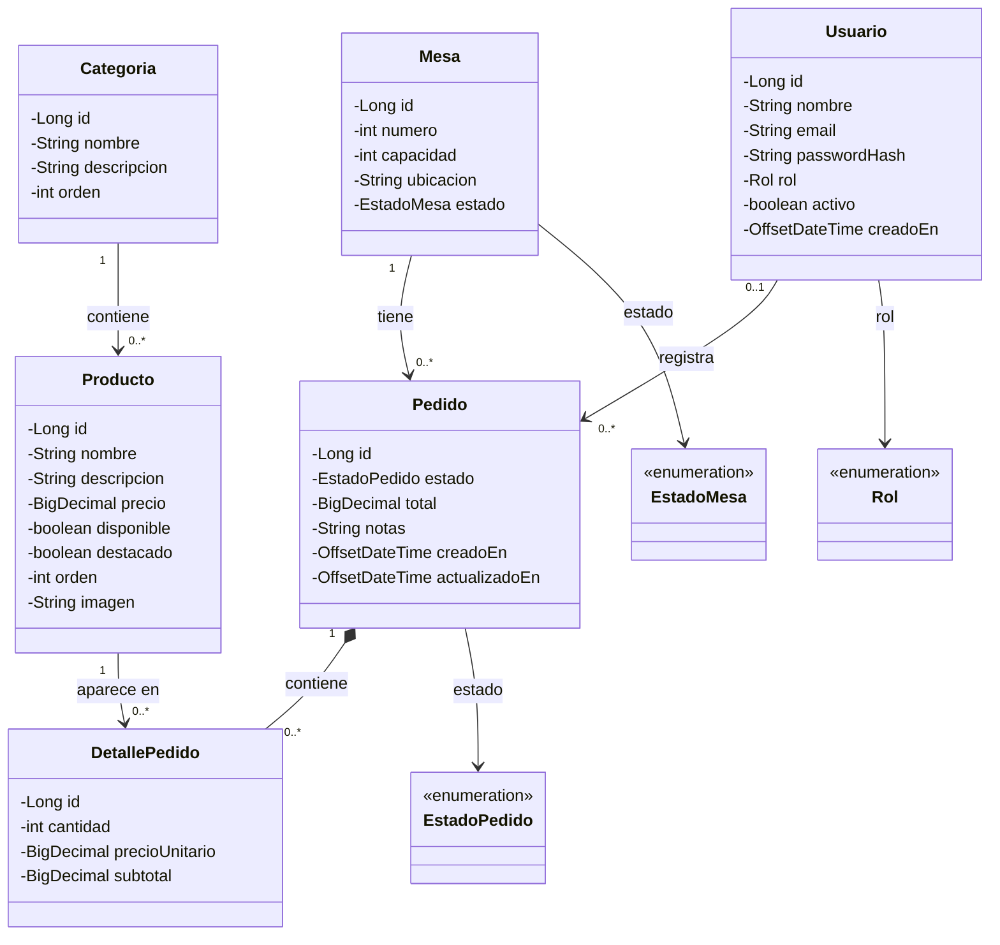

# Diagrama de clases - Sakura

```mermaid
classDiagram
    class Categoria {
        -Long id
        -String nombre
        -String descripcion
        -int orden
    }

    class Producto {
        -Long id
        -String nombre
        -String descripcion
        -BigDecimal precio
        -boolean disponible
        -boolean destacado
        -int orden
        -String imagen
    }

    class Mesa {
        -Long id
        -int numero
        -int capacidad
        -String ubicacion
        -EstadoMesa estado
    }

    class Usuario {
        -Long id
        -String nombre
        -String email
        -String passwordHash
        -Rol rol
        -boolean activo
        -OffsetDateTime creadoEn
    }

    class Pedido {
        -Long id
        -EstadoPedido estado
        -BigDecimal total
        -String notas
        -OffsetDateTime creadoEn
        -OffsetDateTime actualizadoEn
    }

    class DetallePedido {
        -Long id
        -int cantidad
        -BigDecimal precioUnitario
        -BigDecimal subtotal
    }

    class EstadoMesa {
        <<enumeration>>
    }

    class EstadoPedido {
        <<enumeration>>
    }

    class Rol {
        <<enumeration>>
    }

    Categoria "1" --> "0..*" Producto : contiene
    Mesa "1" --> "0..*" Pedido : tiene
    Usuario "0..1" --> "0..*" Pedido : registra
    Pedido "1" *-- "0..*" DetallePedido : contiene
    Producto "1" --> "0..*" DetallePedido : aparece en
    Mesa --> EstadoMesa : estado
    Pedido --> EstadoPedido : estado
    Usuario --> Rol : rol
```
